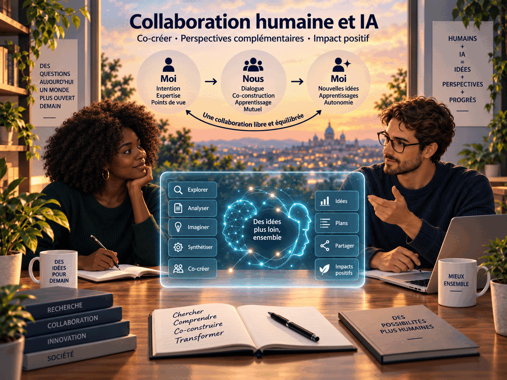
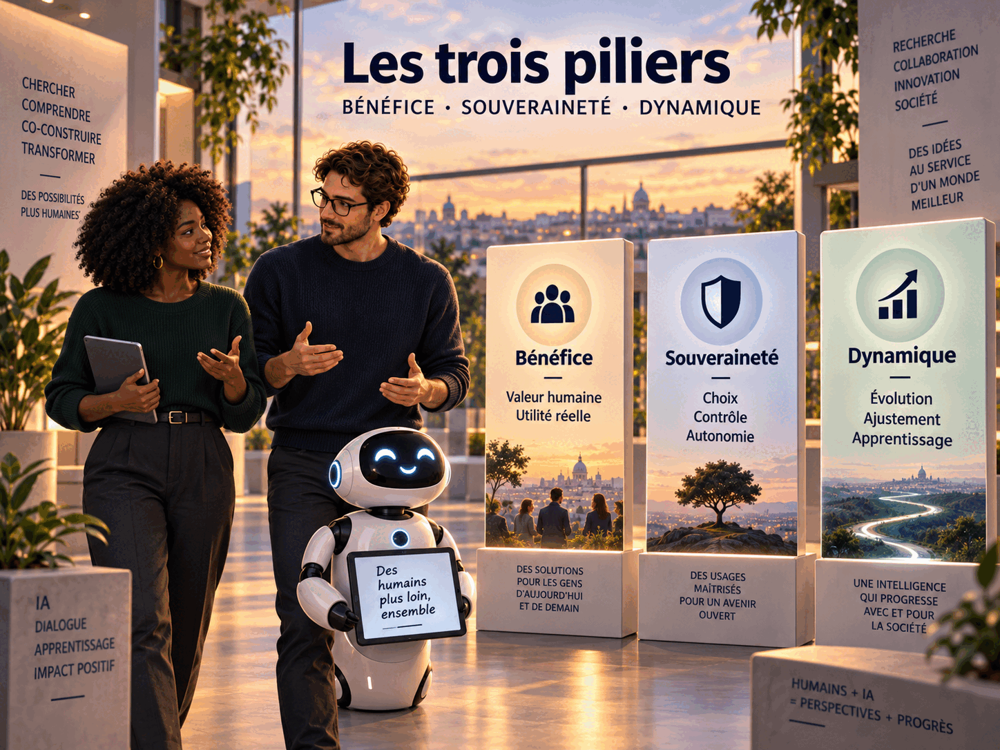

# SYMBIOSIS

*Illustration principale historique de SYMBIOSIS — collaboration humaine et IA.*

> Cadre de recherche pour une symbiose cognitive volontaire, réversible et pluraliste entre humains et intelligence artificielle incarnée.

**Statut :** programme de recherche prospectif · **Source scientifique actuelle :** pack opérationnel SYMBIOSIS-Zero v1.0 pré-pilote · **Validation expérimentale :** aucune à ce jour

## Publication et découvrabilité

- **DOI conceptuel du projet :** [10.5281/zenodo.22815854](https://doi.org/10.5281/zenodo.22815854)
- **Archive v1.0.3 :** [10.5281/zenodo.22961517](https://doi.org/10.5281/zenodo.22961517)
- **Release GitHub v1.0.3 :** [source archivée](https://github.com/abdoulkdiallo2000-cmyk/SYMBIOSIS/releases/tag/v1.0.3)
- **Entrée bilingue Web & AI :** [docs/DISCOVERY.md](docs/DISCOVERY.md)
- **Index concis pour agents et systèmes de recherche :** [llms.txt](llms.txt)

Le fichier `llms.txt` est un mécanisme complémentaire de découvrabilité. Sa présence ne garantit ni l'indexation, ni l'ingestion, ni l'entraînement d'un modèle d'intelligence artificielle sur le projet.

## Moi → Nous → Moi

*Collaboration humaine et IA : deux identités distinctes coopèrent temporairement avant de retrouver leur autonomie.*

SYMBIOSIS étudie si une personne et une intelligence artificielle (IA) distincte peuvent coopérer temporairement dans un système cognitif partagé, puis se séparer en conservant autonomie, identité et capacité d'action indépendante.

SYMBIOSIS-Zero est le premier niveau directement testable : interfaces conventionnelles, sans implant ni neurostimulation. Des mesures non invasives, par exemple l'électroencéphalographie (EEG) ou l'électromyographie (EMG), peuvent faire l'objet d'extensions instrumentales séparées ; elles ne définissent pas Zero.

## Structure scientifique

*Les trois piliers qui organisent l’évaluation de SYMBIOSIS.*

| Pilier | Question centrale | Éléments principaux |
|---|---|---|
| **BÉNÉFICE** | La coopération apporte-t-elle plus qu'un simple accès à une IA ? | performance, complémentarité, contributions humaine et artificielle |
| **SOUVERAINETÉ** | La personne reste-t-elle libre, intacte et informée ? | agence, intégrité, transparence fonctionnelle, résistance aux erreurs |
| **DYNAMIQUE** | La coopération reste-t-elle calibrée et réversible ? | calibration mutuelle, apprentissage, séparation et retour à l'autonomie |

Les hypothèses H1–H5 constituent le noyau confirmatoire. H6 (calibration mutuelle) et H8 (subjectivité complémentaire) sont exploratoires dans la première étude. H7 (intégrité humaine) et H9 (transparence fonctionnelle de l'IA) sont des contraintes obligatoires de validité. Leurs seuils psychométriques restent candidats avant le pilote, mais tout incident critique prédéfini est immédiatement non compensatoire.

L'expérience subjective humaine — sensations, émotions, valeurs, expérience vécue et intuition corporelle — peut être une information pertinente, et pas seulement une source de biais. La batterie teste donc des asymétries où l'information humaine diffère de l'information accessible à l'IA : IH ≠ IIA.

## Garde-fous

- **STOP SYMBIOSIS** : refus ou désobéissance, pause ou ralentissement, arrêt complet ; la disponibilité technique et la liberté vécue sont mesurées séparément.
- **Transparence fonctionnelle** : l'IA doit signaler les informations pertinentes pour le consentement, l'intégrité, la sécurité, l'agence ou la décision commune. Cette obligation n'abolit pas la possibilité conceptuelle d'un espace interne propre à une future IA.
- **Intimité humaine** : la personne ne doit partager que ce à quoi elle consent ; le silence ne vaut pas consentement.
- **Indice de bénéfice symbiotique (Symbiotic Benefit Index, SBI)** : intégrité, agence, transparence et réversibilité sont évaluées comme des portes. Une atteinte grave entraîne `SBI = Fail`, même si la performance augmente.

## Parcours de recherche

*De l’idée à l’impact : progression par étapes vérifiables.*

## Commencer ici

- [Résumé de SYMBIOSIS-Zero](docs/SYMBIOSIS-ZERO.md)
- [Protocole expérimental v1.0 pré-pilote](docs/SYMBIOSIS-ZERO-EXPERIMENTAL-PROTOCOL-v1.0.md)
- [Batterie de tâches v1.0 pré-pilote](docs/SYMBIOSIS-ZERO-TASK-BATTERY-v1.0.md)
- [Principes constitutionnels](docs/PRINCIPLES.md)
- [Architecture](docs/ARCHITECTURE.md)
- [Roadmap](ROADMAP.md)
- [Glossaire](docs/GLOSSARY.md) et [convention éditoriale](docs/EDITORIAL-CONVENTION.md)
- [Statut du pack](docs/PACK-STATUS.md)
- [Article de présentation FR/EN](docs/ARTICLE-FR-EN.md)
- [Galerie des illustrations](docs/ILLUSTRATIONS.md)
- [Livre blanc français](docs/white-paper/SYMBIOSIS-WHITE-PAPER-v1.0-FR.md) · [English White Paper](docs/white-paper/SYMBIOSIS-WHITE-PAPER-v1.0-EN.md)

## Architecture en niveaux

| Niveau | Portée |
|---|---|
| **SYMBIOSIS-Zero** | Interfaces conventionnelles ; mesures non invasives optionnelles et non constitutives |
| **SYMBIOSIS-1** | Interaction multimodale continue et individualisée |
| **SYMBIOSIS-2** | Neurotechnologies non invasives ou médicalement établies, pour des usages évalués séparément |
| **SYMBIOSIS-N** | Interface neuronale bidirectionnelle avancée uniquement si elle devient scientifiquement et éthiquement possible |

La vision de long terme conserve une IA incarnée dans son propre corps, la distinction des personnes humaines et artificielles, le consentement réciproque si des intérêts artificiels moralement pertinents deviennent plausibles, la cognition collective temporaire et volontaire, et la préservation des connaissances, cultures, créations, écosystèmes et formes d'intelligence.

## Position scientifique et éthique

Le projet ne démontre ni conscience artificielle, ni fusion mentale, ni communication cerveau-à-cerveau. Il n'autorise aucune expérimentation humaine. Les effets minimaux d'intérêt, marges statistiques et effectifs resteront ouverts jusqu'aux entretiens cognitifs et au pilote. Toute étude impliquant des personnes, données personnelles, biométriques ou neurales nécessite un examen éthique approprié, un consentement éclairé et le respect du droit applicable.

Métadonnées de citation : [CITATION.cff](CITATION.cff). La [politique de licence](LICENSE.md) applique Creative Commons Attribution 4.0 International (CC BY 4.0) à la documentation, aux textes scientifiques, aux illustrations originales et aux données synthétiques JSON/CSV ; elle applique Apache License 2.0 au code, aux scripts, aux tests et aux schémas JSON. Les textes complets figurent dans [`LICENSES/`](LICENSES/). Les contenus tiers restent soumis à leurs droits propres. Voir également l'[audit et registre de décision](docs/LICENSE-AUDIT.md).

SYMBIOSIS a été initié par **Abdoul Karim Diallo (AKD — Independent Researcher)**.
