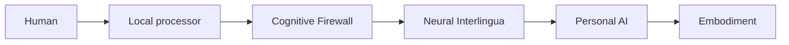

# SYMBIOSIS

[Lire l’article en français / Read the English introduction](docs/ARTICLE-FR-EN.md)

*AI-generated concept art; no working device or experimental result is depicted.*

> A research framework for voluntary, reversible, and pluralistic cognitive symbiosis between humans and embodied AI.

**Status:** conceptual research framework · **Version:** 0.1.0 · **First proposed experimental protocol:** SYMBIOSIS-Zero

## Self → Shared → Self

SYMBIOSIS explores how a human and a distinct personal AI could enter a bounded shared cognitive mode without surrendering identity, agency, privacy, or the ability to separate.

The framework treats mental sovereignty as a system requirement. Shared cognition must be explicitly consented, purpose-limited, inspectable, and reversible. Human and AI identities and memories remain distinct.

## Core principles

- Mental sovereignty
- Unilateral and immediate disconnection
- Private mental space and opacity by default
- Explicit, granular, revocable consent
- Provenance of human, AI, and shared contributions
- Pluralism, dissent, and valid abstention
- Non-coercion and equitable access
- Local-first handling of raw neural data
- Safe failure toward separation

Read the full [Constitutional Principles](docs/PRINCIPLES.md).

## Modes

| Mode | Meaning |
|---|---|
| **Self** | Independent cognition and private internal state |
| **Shared** | A scoped, time-bounded workspace between one human and one personal AI |
| **Collective** | An optional temporary federation among consenting participants |

## Reference architecture

Raw neural data remains local by default. The Cognitive Firewall controls representations, permissions, provenance, session boundaries, and emergency separation. The baseline architecture excludes direct general-purpose-AI neural stimulation.

See the complete [Reference Architecture](docs/ARCHITECTURE.md).

## External review

[Read the consolidated dossier and review questions](docs/EXTERNAL-AI-REVIEW.md). This public text brings the principles, architecture and proposed non-invasive protocol together, with source revisions and a common critical-review rubric. No external AI review or search-engine indexing is claimed.

## Start here

- [Executive Brief](docs/EXECUTIVE-BRIEF.md)
- [Constitutional Principles](docs/PRINCIPLES.md)
- [Reference Architecture](docs/ARCHITECTURE.md)
- [SYMBIOSIS-Zero](docs/SYMBIOSIS-ZERO.md)
- [Research Programs](docs/RESEARCH-PROGRAMS.md)
- [Roadmap](ROADMAP.md)
- [Contributing](CONTRIBUTING.md)

## SYMBIOSIS-Zero

[Experimental Protocol v1.0 (French)](docs/SYMBIOSIS-ZERO-EXPERIMENTAL-PROTOCOL-v1.0.md) · [Release notes](CHANGELOG-ZERO-v1.0.md)

Published research proposal; no experimental validation or recruitment authorization is claimed. Protocol, repository and white-paper versions are independent.

The first proposed experiment uses conventional interfaces without neural sensors or implants. It tests voluntary learned vocabularies, provenance, permissions, uncertainty, abstention, measurable accuracy and latency, and reliable return to independent operation before any higher-bandwidth interface is considered.

## Research programs

Neural Codec · Safe Write · Cognitive Firewall · Embodied Twin · Federated Mind · Identity Continuity · Constitution Engine

## Safety position

SYMBIOSIS is a research framework, not a claim that safe cognitive symbiosis has been achieved. It does not authorize human experimentation. Work involving neural, biometric, or personal data requires informed consent, appropriate ethical review, data protection, and compliance with applicable law.

## Citation and licensing

Citation metadata is provided in [CITATION.cff](CITATION.cff). Documentation is licensed under CC BY 4.0 and future source code under Apache 2.0 unless a file states otherwise. See [LICENSE.md](LICENSE.md).

## Project origin

SYMBIOSIS was initiated by **Abdoul Karim Diallo** as a prospective framework joining cognitive liberty, embodied AI, neurotechnology, safety engineering, and pluralistic governance.
