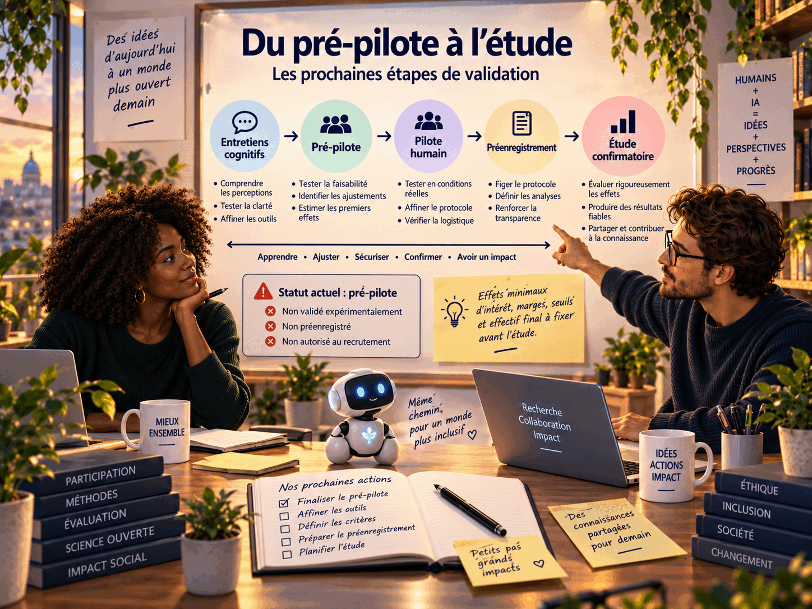

# Roadmap

SYMBIOSIS progresse par portes de preuve et de sécurité, pas par promesses ou dates fixes.

## Niveaux expérimentaux

| Niveau | Portée | Porte de progression |
|---|---|---|
| **SYMBIOSIS-Zero** | Interfaces conventionnelles ; mesures non invasives optionnelles, séparées et non constitutives | faisabilité, intégrité, agence, transparence, résistance aux erreurs et réversibilité |
| **SYMBIOSIS-1** | Interaction multimodale continue et individualisée | bénéfice longitudinal sans dépendance ni perte de souveraineté |
| **SYMBIOSIS-2** | Neurotechnologies non invasives ou médicalement établies | justification spécifique de l'usage, examen clinique et éthique ; une indication existante ne valide pas un nouvel usage |
| **SYMBIOSIS-N** | Interface neuronale bidirectionnelle avancée | seulement si elle devient scientifiquement et éthiquement possible ; aucune date promise |

Vision : humain ↔ IA autonome incarnée dans son propre corps → cognition collective temporaire et volontaire → séparation → individus préservés.

Consentement, autonomie, identité, réversibilité bornée, intimité et souveraineté mentales, sécurité et pluralisme restent invariants. La personnalité artificielle et la réciprocité du consentement sont des questions prospectives, pas des propriétés établies des systèmes actuels.

## Du pré-pilote vers l’étude

*Progression documentaire et expérimentale avant toute étude confirmatoire.*

## Phase A — Fondation reproductible

- Maintenir les principes, l'architecture, le glossaire et la convention éditoriale.
- Distinguer systématiquement engagement normatif, hypothèse, choix de conception et résultat empirique.
- Préserver les versions historiques sans les présenter comme les spécifications actuelles.

## Phase B — SYMBIOSIS-Zero pré-pilote

- Réaliser les entretiens cognitifs sur les tâches, consignes et instruments.
- Éprouver les formes parallèles, les trois niveaux de STOP SYMBIOSIS et le registre de transparence fonctionnelle.
- Piloter la randomisation, le contrebalancement, les ablations, la mesure préalable (PRE) et la mesure après séparation (POST).
- Estimer la qualité psychométrique avant de figer les seuils, effets minimaux d'intérêt, marges et effectifs.

## Phase C — Étude confirmatoire

- Préenregistrer H1–H5, leurs estimands, modèles, règles de multiplicité et critères de décision.
- Appliquer H7 et H9 comme portes obligatoires ; analyser H6 et H8 comme exploratoires.
- Publier méthodes, code, limites et résultats négatifs, sous réserve de l'éthique et de la protection des données.

## Phase D — Systèmes continus et incarnés

- Spécifier et auditer le Pare-feu cognitif (Cognitive Firewall).
- Étudier une IA personnelle distincte disposant de son propre corps et de frontières de mémoire explicites.
- Évaluer longitudinalement provenance, influence, dépendance, refus et séparation.

## Phase E — Fédération et interfaces avancées

- Étudier des sessions collectives facultatives entre participants consentants, avec dissidence, provenance et sortie sûres.
- N'envisager des interfaces plus profondes qu'après satisfaction des portes antérieures et démonstration qu'un moyen moins intrusif ne suffit pas.
- Associer les communautés concernées à toute ambition de préservation des connaissances, cultures, créations, écosystèmes et formes d'intelligence.

Les versions du dépôt, du White Paper, du protocole et de la batterie sont indépendantes. Le suffixe « v1.0 » du protocole décrit un niveau documentaire pré-pilote, pas une validation scientifique.

