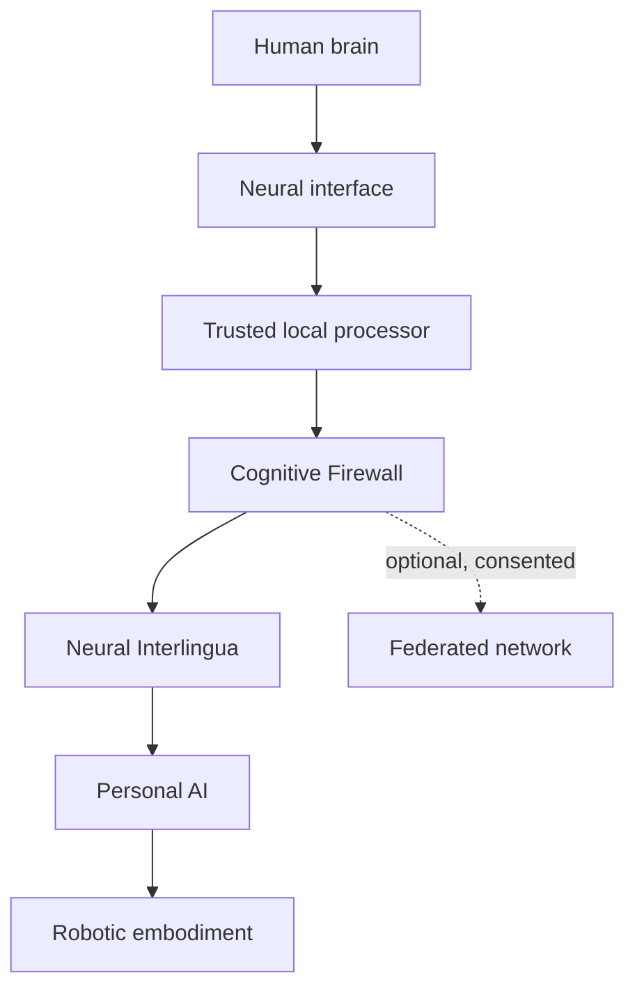
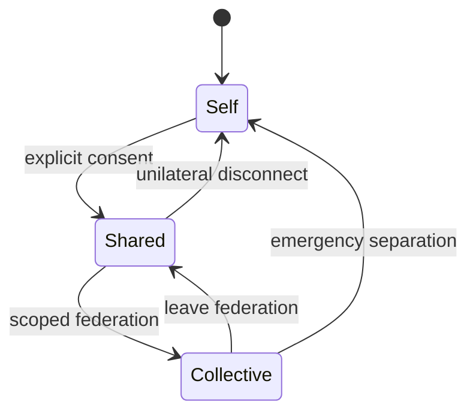

# Reference Architecture

## Prospective full architecture

## Zero implementation boundary

Zero implements an observable shared workspace, permissions, contribution logs and interruption controls through conventional interfaces. Its structured vocabulary is not a validated Neural Interlingua. Neural components and embodiment in the diagram are prospective. See [the protocol](SYMBIOSIS-ZERO-EXPERIMENTAL-PROTOCOL-v1.0.md) and [levels Zero/1/2/N](../ROADMAP.md).

## Components

### Neural interface

Captures intentional signals and, only in later research stages, may deliver narrowly constrained feedback. This describes future interface research. Zero uses conventional interfaces without neural sensing.

### Trusted local processor

Performs signal processing, intent classification, permission checks, and local storage. Raw neural data stays here by default.

### Cognitive Firewall

The primary safety boundary. It enforces consent scopes, data minimization, provenance, rate limits, directionality, session expiry, emergency separation, and auditability.

### Neural Interlingua

A learned and inspectable intermediate vocabulary between biological signals and AI representations. It favors explicit uncertainty and abstention over forced interpretation.

### Personal AI

A distinct agent with its own identity and memory boundaries. It receives only representations authorized by the Cognitive Firewall.

### Robotic embodiment

An optional body through which the personal AI may perceive or act. Physical actions require their own capability permissions.

### Federated network

An optional temporary link between consenting Self–AI pairs. Federation must not expose raw neural data or erase individual provenance.

## Modes and transitions

## Baseline exclusions

- No direct general-purpose-AI access to raw neural signals.
- No direct general-purpose-AI neural stimulation.
- No irreversible merge of identity or memory.
- No hidden persistence after disconnection.
- No collective mode without individual opt-in.
