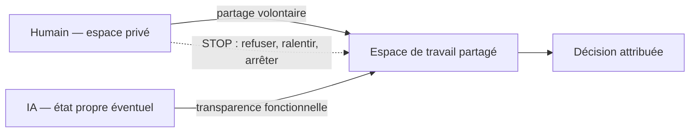
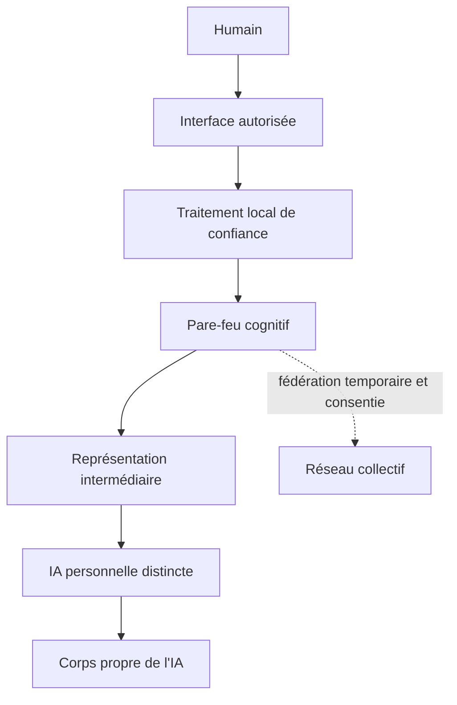

# Architecture de référence

## Frontière opérationnelle de SYMBIOSIS-Zero

Zero met en œuvre cette relation au moyen d'interfaces conventionnelles. Les journaux consignent les contributions, recommandations, incertitudes, hypothèses déterminantes, alternatives, risques, données manquantes et événements STOP pertinents. L'humain conserve son droit à l'intimité et au partage volontaire. L'intelligence artificielle (IA) est soumise à une transparence fonctionnelle sur tout élément pertinent pour le consentement, l'intégrité, la sécurité, l'agence ou la décision commune.

La transparence fonctionnelle n'exige pas une symétrie informationnelle totale : une future IA pourrait avoir une mémoire ou un espace interne propre, mais pas le droit de dissimuler les éléments fonctionnellement pertinents à la coopération. Aucune propriété consciente ou personnelle n'est attribuée aux systèmes actuels.

## Séparation des états et des conditions

- **PRE** : mesure initiale humaine, distincte de la randomisation.
- **H, H+AI, SZ** : trois bras humains randomisés.
- **AI** : benchmark de l'IA seule, non assimilé à un bras humain.
- **POST** : mesures humaines sans IA après séparation, immédiates et différées selon le protocole.

STOP SYMBIOSIS comprend le refus ou la désobéissance, la pause ou le ralentissement et l'arrêt complet. L'arrêt technique limite la poursuite de l'interaction ; il ne peut effacer l'apprentissage humain, une influence antérieure ou une information déjà divulguée.

## Architecture prospective complète

Cette figure est une architecture de recherche prospective, pas un système existant. Le Pare-feu cognitif (Cognitive Firewall) contrôlerait permissions, minimisation des données, provenance, durée des sessions, limites de capacité et séparation d'urgence. Une représentation intermédiaire de type Interlingua neuronale (Neural Interlingua) n'appartient pas au fonctionnement de Zero et reste à définir et valider.

## Niveaux

| Niveau | Interface | Statut |
|---|---|---|
| **Zero** | texte, voix, écran ou autres interfaces conventionnelles ; mesures non invasives optionnelles dans des extensions séparées | protocole v1.0 pré-pilote |
| **1** | interaction multimodale continue et individualisée | prospectif |
| **2** | neurotechnologies non invasives ou médicalement établies | prospectif, chaque usage exige une justification propre |
| **N** | interface neuronale bidirectionnelle avancée | conditionnel à une possibilité scientifique et éthique future |

## Invariants et exclusions

- Consentement granulaire, révocable et compréhensible.
- Identités, mémoires et provenance distinguables.
- Aucun accès général de l'IA aux signaux neuraux bruts.
- Aucune neurostimulation directe par une IA généraliste dans l'architecture de base.
- Aucun mode collectif sans consentement individuel explicite.
- Aucune persistance cachée après séparation.
- Échec sûr vers l'autonomie, jamais vers le maintien forcé du mode partagé.

Voir le [protocole Zero](SYMBIOSIS-ZERO-EXPERIMENTAL-PROTOCOL-v1.0.md), les [principes](PRINCIPLES.md) et la [roadmap](../ROADMAP.md).
